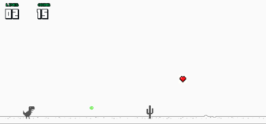

A simple game made in python for our software engineer course. It's a remake of the famous game from google chrome browser.


## Usage
```
$ pip install -r requirements.txt
$ ./init
```
## How to play
In the choose character menu, you have to click in the number and the dino.
* **Up key** to jump
* **Down key** to go down
* **H key** to shoot (cost 5 coins)

## Coins
* **Ether** - 1 coin
* **Bitcoin** - 2 coins
* **Dogecoin** - 4 coins (such money)

## Game running



### Authors:
  
  * [Vinicius Macelai](https://github.com/Macelai)
  
  * [Lucas Bordignon](https://github.com/Lucaspbordignon)
